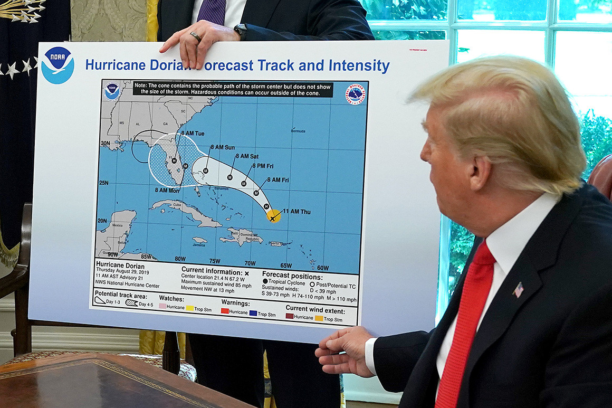

[An Oval Office mystery: Who doctored the hurricane map? - POLITICO](https://www.politico.com/story/2019/09/04/donald-trump-sharpie-hurricane-map-1481733)

By CAITLIN OPRYSKO. 09/04/2019 06:26 PM EDT

With two major Category 3+ Hurricanes striking the United States in less than two weeks
and Trump undermining the federal government's rescue and relief response, it is important
and voters to realize that Trump is not interested in you. Trump is just interested in himself!

- **Sharpiegate Incident**: President Trump displayed a map of Hurricane Dorian's path with a Sharpie-altered extension to include Alabama, which was not in the original forecast.
- **Controversy**: The National Weather Service quickly corrected Trump's statement, clarifying that Alabama was not at risk.
- **Legal Implications**: Altering official weather forecasts could potentially violate federal law.
- **Public Reaction**: The incident sparked widespread discussion and mockery on social media, with "Sharpiegate" trending on Twitter.

Doubling down later, Trump continued "It may get a little piece of a great place — it’s called
Alabama. And Alabama could even be in for at least some very strong winds and something
more than that, it could be. This just came up, unfortunately."

Birmingham’s branch of the National Weather Service rushed to correct the record, clarifying
in a tweet 20 minutes after Trump’s original that “Alabama will NOT see any impacts from
#Dorian” because the system would remain too far east.

Confronted by reporters on Wednesday about the apparent Sharpie edit, the president
employed a common dodge: “I don’t know,” he told reporters three times.

He first insisted the White House would be issuing “a better map. I know that Alabama was
in the original forecast. They thought it would get it, as a piece of it,” Trump said. “We have
a better map than that, which is going to be presented where we had many lines going
directly, many models — each line being a model — and they were going directly through.
And in all cases Alabama was hit, if not likely, in some cases pretty hard. It was a different
route. They actually gave that a 95 percent chance probability. It turned out that was not
what happened. It made the right turn up the coast, but Alabama was hit very hard — was
going to be hit very hard.”

Sharpiegate may have run afoul of the law[^11], which calls for either a fine or no more than
90 days in jail — or both — for **“whoever knowingly issues or publishes any counterfeit
weather forecast or warning of weather conditions falsely representing such forecast or
warning to have been issued or published by the Weather Bureau, United States Signal Service,
or other branch of the Government service.”**

Trump also defended his Twitter forecasting earlier in the week, decrying a report from ABC
News White House correspondent Jon Karl and claiming that “under certain original scenarios,
it was in fact correct that Alabama could have received some ‘hurt.’”
Trump weighed in on the melee for the third time Wednesday with an evening tweet, posting a
photo of what he said were early models of the storm’s possible paths dated Aug. 28. “As you
can see, almost all models predicted it to go through Florida also hitting Georgia and Alabama,”
he said, referring to a handful of possible paths that showed the storm making landfall in the U.S.
as far west as Louisiana.

“I accept the Fake News apologies!” he added.[^12]

[^11]: [18 U.S. Code § 2074 - False weather reports / U.S. Code / US Law / LII / Legal Information Institute](https://www.law.cornell.edu/uscode/text/18/2074) Whoever knowingly issues or publishes any counterfeit weather forecast or warning of weather conditions falsely representing such forecast or warning to have been issued or published by the Weather Bureau, United States Signal Service, or other branch of the Government service, shall be fined under this title or imprisoned not more than ninety days, or both. (June 25, 1948, ch. 645, 62 Stat. 795; Pub. L. 103–322, title XXXIII, § 330016(1)(G), Sept. 13, 1994, 108 Stat. 2147.)

[^12]: @RalphHightower: Trump certainly is humble. Ain't he?  **NO!**
