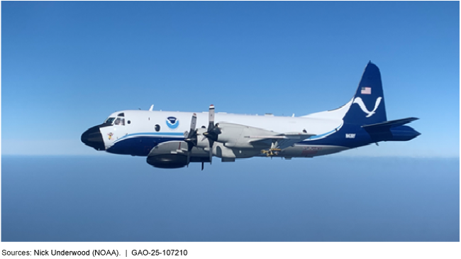
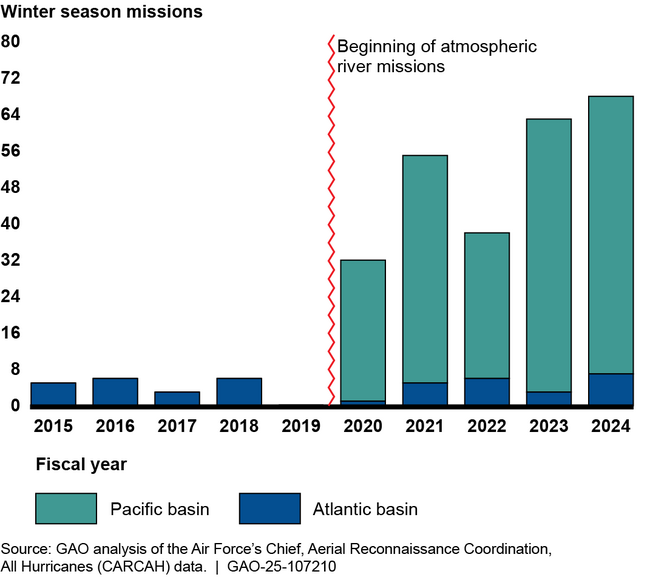

## [Hurricane Hunter Aircraft: NOAA and Air Force Should Take Steps to Meet Growing Demand for Reconnaissance Missions / U.S. GAO](https://www.gao.gov/products/gao-25-107210)
NOAA and Air Force Should Take Steps to Meet Growing Demand for Reconnaissance Missions
GAO-25-107210
Published: Feb 13, 2025. Publicly Released: Mar 14, 2025.

### Fast Facts:
The National Oceanic and Atmospheric Administration and the Air Force fly Hurricane Hunter aircraft into tropical cyclones and winter storms to collect data for weather forecasts.

Demand for their work has grown since 2014 as tropical cyclone activity increased, and as they were tapped to begin collecting data on Pacific storms that can cause West Coast floods.

The Hurricane Hunters haven't always met rising demand and haven't systematically tracked the reasons why.

But officials told us about:

Aircraft maintenance issues and staff shortages

A lack of coordination on aircraft upgrades and replacement

Our [recommendations](https://www.gao.gov/products/gao-25-107210#summary_recommend) address this, and more.

NOAA operates two Lockheed WP-3D Orion aircraft as Hurricane Hunters

### Highlights

#### Why This Matters

The National Oceanic and Atmospheric Administration (NOAA) and the Air Force fly aircraft—known as Hurricane Hunters—into tropical cyclones and winter storms. Equipment on these aircraft collects critical data to help forecast a storm’s track and intensity.

Information from these aerial reconnaissance missions helps with evacuation efforts and storm preparations to protect life and property.

#### GAO Key Takeaways

Hurricane Hunter operations have increased since 2014, especially winter season missions, because of new responsibilities and greater demand for data. This has strained NOAA’s and the Air Force’s ability to meet their Hurricane Hunter responsibilities.

NOAA and Air Force officials said that limited aircraft availability and staffing shortages have contributed to Hurricane Hunters missing mission requirements—the key tasks of a mission. For example, they said maintenance issues prevented NOAA’s sole high-altitude jet from flying two Hurricane Helene missions in 2024. Since 2014, a growing number of mission requirements have been missed. However, NOAA and the Air Force have not systematically tracked the reasons for this. They also have not comprehensively assessed their Hurricane Hunter workforces to see if changes to staffing levels or workforce structure are needed.

NOAA plans to acquire six aircraft to replace its three aging planes, and the Air Force has identified needed technology upgrades for its aircraft. However, NOAA and Air Force senior leaders do not have a mechanism to regularly communicate with each other about their plans and resources. This has hampered the agencies’ ability to ensure that their decisions about investments in the Hurricane Hunters are aligned.

Winter Season Reconnaissance Missions Have Increased

#### Why This Matters

The National Oceanic and Atmospheric Administration (NOAA) and the Air Force fly aircraft—known as Hurricane Hunters—into tropical cyclones and winter storms. Equipment on these aircraft collects critical data to help forecast a storm’s track and intensity.

Information from these aerial reconnaissance missions helps with evacuation efforts and storm preparations to protect life and property.

#### GAO Key Takeaways

Hurricane Hunter operations have increased since 2014, especially winter season missions, because of new responsibilities and greater demand for data. This has strained NOAA’s and the Air Force’s ability to meet their Hurricane Hunter responsibilities.

NOAA and Air Force officials said that limited aircraft availability and staffing shortages have contributed to Hurricane Hunters missing mission requirements—the key tasks of a mission. For example, they said maintenance issues prevented NOAA’s sole high-altitude jet from flying two Hurricane Helene missions in 2024. Since 2014, a growing number of mission requirements have been missed. However, NOAA and the Air Force have not systematically tracked the reasons for this. They also have not comprehensively assessed their Hurricane Hunter workforces to see if changes to staffing levels or workforce structure are needed.

NOAA plans to acquire six aircraft to replace its three aging planes, and the Air Force has identified needed technology upgrades for its aircraft. However, NOAA and Air Force senior leaders do not have a mechanism to regularly communicate with each other about their plans and resources. This has hampered the agencies’ ability to ensure that their decisions about investments in the Hurricane Hunters are aligned.

Winter Season Reconnaissance Missions Have Increased

Note: Atmospheric rivers are regions in the atmosphere that transport water vapor from the tropics to higher latitudes, leading to extreme precipitation and flooding on the U.S. West Coast. This figure includes reconnaissance missions NOAA and the Air Force flew but does not include other types of missions such as research missions focused on atmospheric rivers.

#### How GAO Did This Study

We analyzed data and documents and interviewed officials from NOAA and the Air Force. We compared agency efforts against our key practices for evidence-based policymaking, among other things.

### Recommendations

We are making eight recommendations, including that NOAA and Air Force track data on why mission requirements are missed, assess their Hurricane Hunter workforces, and establish a mechanism for senior leaders to regularly communicate. The agencies agreed with our recommendations.

#### Recommendations for Executive Action

| Agency Affected	| Recommendation |	Status |
|---|---|---|
| Department of the Air Force	| The Commander of the Air Force Reserve Command should, in coordination with the Administrator of NOAA, develop and implement a process to systematically track data on the reasons Hurricane Hunter mission requirements are missed. (Recommendation 1)	| Open   When we confirm what actions the agency has taken in response to this recommendation, we will provide updated information. |
| National Oceanic and Atmospheric Administration	| The Administrator of NOAA should, in coordination with the Commander of the Air Force Reserve Command, develop and implement a process to systematically track data on the reasons Hurricane Hunter mission requirements are missed. (Recommendation 2)	| Open   When we confirm what actions the agency has taken in response to this recommendation, we will provide updated information. |
| Department of the Air Force |	The Commander of the Air Force Reserve Command should perform a comprehensive assessment of its Hurricane Hunter workforce, including examining staffing levels and workforce structure, to inform future workforce planning. (Recommendation 3)	| Open   When we confirm what actions the agency has taken in response to this recommendation, we will provide updated information. |
| National Oceanic and Atmospheric Administration	| The Administrator of NOAA should perform a comprehensive assessment of its Hurricane Hunter workforce, including examining staffing levels and workforce structure, to inform future workforce planning. (Recommendation 4)	| Open   When we confirm what actions the agency has taken in response to this recommendation, we will provide updated information. |
| Department of Commerce |	The Secretary of Commerce should ensure that NOAA's funding needs for Hurricane Hunter aircraft acquisitions are regularly communicated to relevant stakeholders, including Congress, such as by including information on these needs in its annual budget requests. (Recommendation 5)	| Open   When we confirm what actions the agency has taken in response to this recommendation, we will provide updated information. |
| Department of the Air Force	| The Commander of the Air Force Reserve Command should assess whether Air Force processes create barriers to upgrading Hurricane Hunter aircraft capabilities and define strategies to mitigate any identified barriers, as appropriate. (Recommendation 6)	| Open   When we confirm what actions the agency has taken in response to this recommendation, we will provide updated information. |
| National Oceanic and Atmospheric Administration	| The Administrator of NOAA should, in coordination with the Commander of the Air Force Reserve Command, establish a mechanism for their senior leaders to regularly communicate and share information about Hurricane Hunter plans and resources. (Recommendation 7)	| Open   When we confirm what actions the agency has taken in response to this recommendation, we will provide updated information. |
| Department of the Air Force	| The Commander of the Air Force Reserve Command should, in coordination with the Administrator of NOAA, establish a mechanism for their senior leaders to regularly communicate and share information about Hurricane Hunter plans and resources. (Recommendation 8)	| Open   When we confirm what actions the agency has taken in response to this recommendation, we will provide updated information. |

### Full Report

[HTML Full Report Online](https://files.gao.gov/reports/GAO-25-107210/index.html?_gl=1*1822xj8*_ga*MTU3MTI2ODQ5OS4xNzM4Mjc1MDI0*_ga_V393SNS3SR*MTc0MTk4MDE3Ny43LjEuMTc0MTk4MjUwOS4wLjAuMA..) | [Highlights Page (1 page)](https://www.gao.gov/assets/gao-25-107210-highlights.pdf) | [Full Report (58 pages)](https://www.gao.gov/assets/gao-25-107210.pdf)

#### GAO Contacts

Cardell Johnson
Director
Natural Resources and Environment
johnsoncd1@gao.gov

### Media Inquiries

Sarah Kaczmarek
Managing Director
Office of Public Affairs
media@gao.gov

### Public Inquiries

 [Contact Us](https://www.gao.gov/about/contact-us)

### Topics

| Natural Resources and Environment | Aircraft | Aircraft maintenance | Cyclones| Human capital management| Hurricanes | Military forces | Reconnaissance aircraft | Storms | Weather forecasting | Labor force

### Multimedia

#### Video

#### Hurricane Hunters: Improvements Needed in Operations, Planning, and Communication

<iframe width="560" height="315" src="https://www.youtube.com/embed/Dst9gNj5iL0?si=EkdsoEZ6BYWeQPaf" title="YouTube video player" frameborder="0" allow="accelerometer; autoplay; clipboard-write; encrypted-media; gyroscope; picture-in-picture; web-share" referrerpolicy="strict-origin-when-cross-origin" allowfullscreen></iframe>

Mar 11, 2025 [#GovernmentAccountabilityOffice](https://www.youtube.com/hashtag/governmentaccountabilityoffice) [#CongressionalWatchdog](https://www.youtube.com/hashtag/congressionalwatchdog) [#USGAO](https://www.youtube.com/hashtag/usgao)
Director Cardell Johnson and his team discuss the findings of a new GAO report on Hurricane Hunter aircraft.  
 The National Oceanic and Atmospheric Administration (NOAA) and the Air Force fly aircraft, known as Hurricane Hunters, into tropical cyclones and winter storms. These aircraft collect critical data to help forecast a storm’s track and intensity—which can help with storm preparations and evacuation efforts.
 NOAA and Air Force officials said that limited aircraft availability and staffing shortages have contributed to Hurricane Hunters missing mission requirements—the key tasks assigned to a mission. We are making eight recommendations, including that NOAA and Air Force track data on why mission requirements are missed, assess their Hurricane Hunter workforces, and establish a mechanism for senior leaders to regularly communicate about Hurricane Hunter plans and resources.

Learn more about GAO: https://gao.gov/about 
Check out the WatchBlog: https://gao.gov/blog 
Check out our Podcasts: https://gao.gov/podcast 

Follow GAO on Social Media: 
X.com/usgao 
Instagram.com/usgao 
LinkedIn.com/company/us-government 
  / usgao  
Facebook.com/usgao 
Flickr.com/photos/usgao 

General Information: The U.S. Government Accountability Office (GAO) is an independent, nonpartisan agency that works for Congress. Often called the "congressional watchdog," GAO investigates how the federal government spends taxpayer dollars. 

Mission: Our Mission is to support the Congress in meeting its constitutional responsibilities and to help improve the performance and ensure the accountability of the federal government for the benefit of the American people. We provide Congress with timely information that is objective, fact-based, nonpartisan, non-ideological, fair, and balanced. 

Check out the report: https://www.gao.gov/products/gao-25-107210

Get transcript: https://www.gao.gov/assets/880/876037.txt
Disclaimer: The U.S. GAO does not promote or endorse any non-Government or commercial content appearing on this page.

- [Lockheed WP-3D Orion / Office of Marine and Aviation …](https://www.omao.noaa.gov/aircraft-operations/aircraft/lockheed-wp-3d-orion)
- [P-3 Orion: Maritime Patrol Aircraft / Lockheed Martin](https://www.lockheedmartin.com/en-us/products/p-3.html)
- Hurricane Hunters
- [Government Accountability Office (GAO)](https://www.gao.gov/)
- [National Oceanic and Atmospheric Administration (NOAA)](https://www.noaa.gov/)
- [National Weather Service (NWS)](http://www.nws.noaa.gov/)
- [U.S. Air Force](https://www.af.mil/)
- [U.S. Department of Commerce (DOC)](https://www.commerce.gov/)
