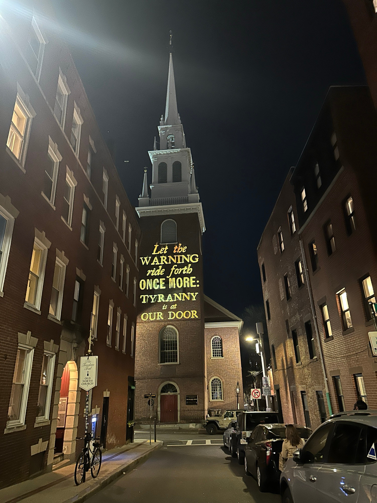
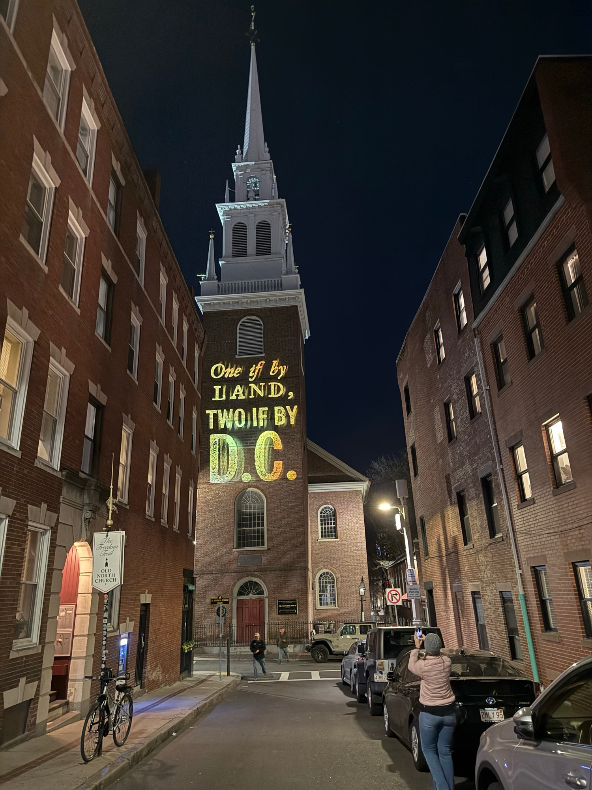
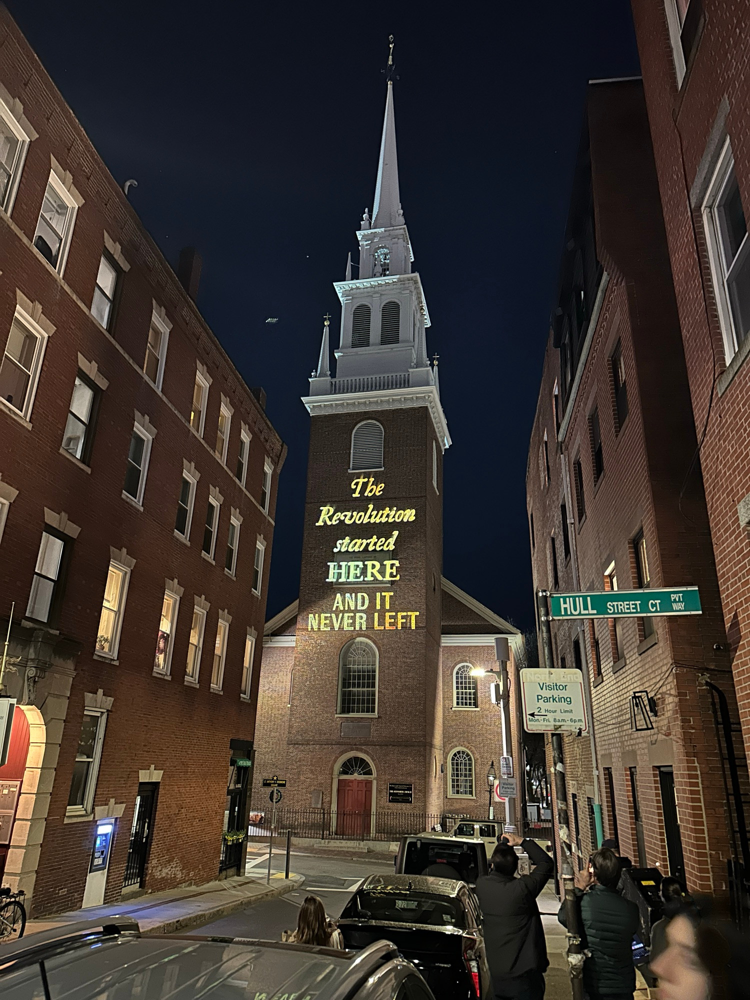

- [250 Years Later, Is It Time For Another Revolution? NY Governor Kathy Hochul Compares Trump To a King]()

## [Updating Old North Church's famous message / Universal Hub](https://images.universalhub.com/2025/updating-old-north-churchs-famous-message)

By adamg on Thu., 4/17/2025 - 11:31 pm

 

 

 

Adam Balsam captured the latest work tonight by Silence Dogood, a local artists' collective using one of Ben Franklin's pen names to spread the word against tyranny, in this case by updating Paul Revere's signal message on the side of Old North Church - the night before the 250th anniversary of the signal being put up in the spire for him.

Let the Warning Ride Forth. Tyranny Is At Our Door
One If By Land. Two If By D.C.
The Revolution Started HERE And It Never Left

