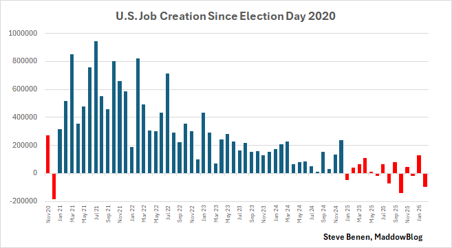

## [U.S. economy lost 92,000 jobs in February as Trump-era job market continues to suffer](https://www.ms.now/rachel-maddow-show/maddowblog/u-s-economy-lost-92000-jobs-in-february-as-trump-era-job-market-continues-to-suffer)

_The more the [president](https://www.whitehouse.gov/) insists the economy is amazing, the more we’re confronted with evidence to the contrary._

Mar. 6, 2026, 8:59 AM EST
By [Steve Benen](https://www.ms.now/author/steve-benen)

Expectations heading into this week showed projections of [about 50,000](https://www.wsj.com/livecoverage/jobs-report-unemployment-stock-market-03-06-2026?mod=hp_lead_pos4) new jobs being created in the United States in February. As it turns out, according to [the new report](https://www.bls.gov/news.release/empsit.nr0.htm) from the [Bureau of Labor Statistics](https:/www.bls.gov/), the totals fell far short of those expectations. [CNBC reported](https://www.cnbc.com/2026/03/06/february-2026-jobs-report.html):

> _Nonfarm payrolls fell by 92,000 for the month, compared to the estimate for 50,000 and below the downwardly revised January total of 126,000. February marked the third time in the past five months that payrolls declined, following a sharp revision showing a drop of 17,000 in December._

At the same time, the unemployment rate edged higher to 4.4% as jobs declined across key areas.

There is no good news here. In fact, during [Joe Biden](https://bidenwhitehouse.archives.gov/)’s four years in the [White House](https://www.whitehouse.gov/), there wasn’t a single month in which the U.S. economy actually lost jobs. It’s become far more common lately: The economy not only shed jobs in February, it also lost jobs in two of the last three months, three of the last five months and five of the last nine months.

All told, [Donald Trump](https://www.donaldjtrump.com/) has been in the [White House](https://www.whitehouse.gov/) for 14 months, and during that time the cumulative total is 150,000 jobs. Over the 14 months preceding the [Republican](https://www.gop.com/) [president](https://www.whitehouse.gov/)’s return to power, the American economy added 1.74 million jobs.

That’s a stunning reversal, which the [Republican](https://www.gop.com/) [administration](https://www.whitehouse.gov/administration/) has made no credible effort to explain or justify.

On the contrary, [Trump](https://www.donaldjtrump.com/) publicly insists on a near-daily basis that the U.S. currently has the single greatest economy in the nation’s history. The latest employment report clearly proves otherwise.

To contextualize the data, I put together this chart to show month-to-month totals since the 2020 election. The blue columns point to [Biden’s presidency](https://bidenwhitehouse.archives.gov/), while the red columns point to [Trump](https://www.donaldjtrump.com/)’s.

It remains to be seen whether the [president](https://www.whitehouse.gov/) responds to the developments by [firing the head of the Bureau of Labor Statistics (again)](https://www.ms.now/rachel-maddow-show/maddowblog/trump-responds-failure-create-jobs-firing-us-labor-statistics-chief-rcna222532).

The question for the [White House](https://www.whitehouse.gov/) remains simple: If [Trump](https://www.donaldjtrump.com/) has created the greatest economy in history, why has American job growth slowed to its lowest pace since the Great Recession?

This post updates our [related earlier coverage](https://www.ms.now/rachel-maddow-show/maddowblog/new-report-shows-2025-was-even-worse-for-u-s-job-market-than-we-thought).

[Steve Benen](https://www.ms.now/author/steve-benen) is a producer for ["The Rachel Maddow Show,"](https://www.ms.now/rachel-maddow-show) the editor of [MaddowBlog](https://www.ms.now/maddowblog) and an [MS NOW](https://www.ms.now/) political contributor. He's also the bestselling author of "Ministry of Truth: Democracy, Reality, and the Republicans' War on the Recent Past."

----
- media
- [MS NOW - Breaking News and News Today / Latest News](https://www.ms.now/)
    - [Rachel Maddow Show](https://www.ms.now/rachel-maddow-show)
        - [MaddowBlog](https://www.ms.now/maddowblog)
            - [Steve Benen](https://www.ms.now/author/steve-benen)
- [Stock Markets, Business News, Financials, Earnings - CNBC](https://www.cnbc.com/)
- [The Wall Street Journal (WSJ) - Breaking News, Business, Financial & Economic News, World News and Video](https://www.wsj.com/)
- political parties
- [Democrat Party](https://www.democrats.org/)
- [Trumpian Party](https://www.gop.com/)
- federal government
- [Constitution of the United States](https://constitution.congress.gov/constitution/)
    - [Supreme Court of the United States (SCOTUS)](https://www.supremecourt.gov/)
        - [US Courts](https://www.uscourts.gov/)
    - [Department of Justice (DOJ)](https://www.justice.gov/)
        - [Federal Bureau of Investigation (FBI)](https://www.fbi.gov/)
    - [Federal Reserve](https://www.federalreserve.gov/)
    - [Federal Reserve Board - Federal Reserve Act](https://www.federalreserve.gov/aboutthefed/fract.htm)
    - [U.S. Department of the Treasury](https://home.treasury.gov/)
    - [Bureau of Labor Statistics](https:/www.bls.gov/)
    - [Congress](https://www.congress.gov/)
        - [Senate](https://www.senate.gov/)
        - [House of Representatives](https://www.house.gov/)
    - [President of the United States (POTUS)](https://www.whitehouse.gov/)
    - [White House (WH)](https://www.whitehouse.gov/)
        - [President Joe Biden](https://bidenwhitehouse.archives.gov/)
- Trump autocracy
    - [Donald J Trump](https://www.donaldjtrump.com/)
        - [President Donald Trump (45)](https://trumpwhitehouse.archives.gov/)
        - [President Donald Trump (47)](https://www.whitehouse.gov/administration/donald-j-trump/)
            - [President Trump (47) Administration](https://www.whitehouse.gov/administration/)
            - [President Trump (47) Cabinet](https://www.whitehouse.gov/administration/the-cabinet/)
                - press secretary
                    - Karoline Leavitt
                - [Scott Bessent / U.S. Department of the Treasury](https://home.treasury.gov/about/general-information/officials/scott-bessent)
                - [Pam Bondi – Office of the Attorney General / Meet the Attorney General / United States Department of Justice](https://www.justice.gov/ag/staff-profile/meet-attorney-general)
                    - [Todd Blanche – Office of the Deputy Attorney General / Office of the Deputy Attorney General](https://www.justice.gov/dag)
                    - [Todd Blanche / LinkedIn](https://www.linkedin.com/in/toddblanche/)
                - [Director Kash Patel — FBI](https://www.fbi.gov/about/leadership-and-structure/director-patel)

  

- grifter
- self-dealing
- corruption
- con artist
- crime
- cryptocurrency
- criminal associates
- criminal businesses
- criminal media
- criminal organizations
- criminal partners